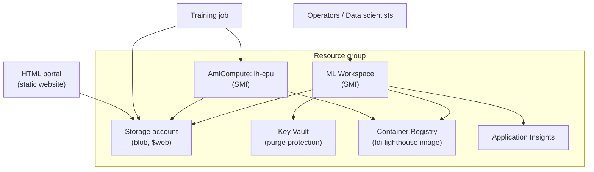
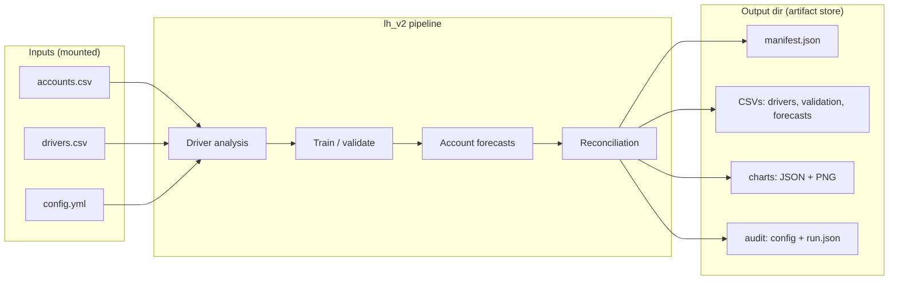
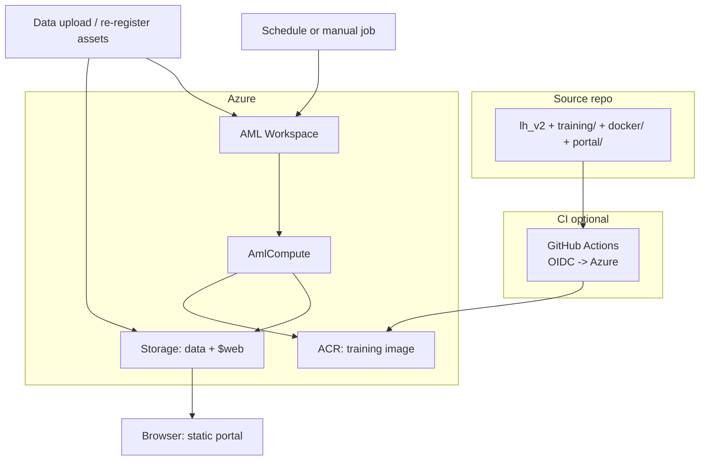
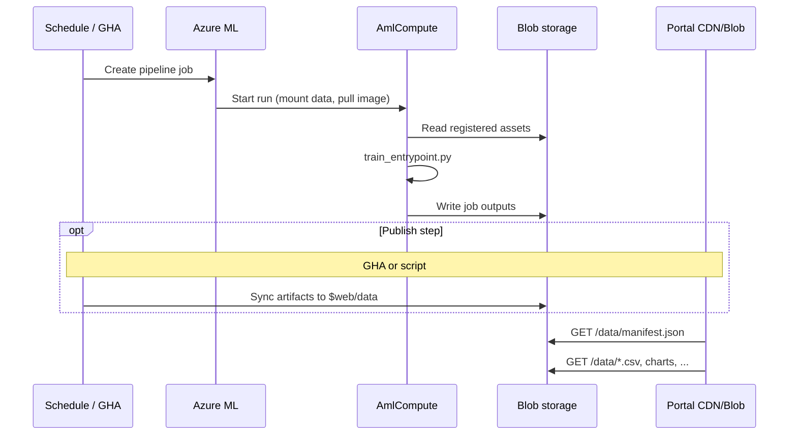

# FDI Lighthouse on Azure: concept & reverse-engineering guide

This document is written so that a technical reader (or an AI agent) can **reconstruct the full solution** from first principles: Azure infrastructure, custom training on Azure Machine Learning, smoke testing, result publishing to a static HTML portal, and the operational fixes encountered along the way. Use the **“reconstruction prompt”** sections as copy-pastable checklists for greenfield or migration work.

---

## 1. Problem statement

**Goal:** Run batch (e.g. monthly) demand / driver-based time-series forecasts using the internal **Lighthouse** library (`lh_v2`), with:

- **CSV inputs** (no PII in the reference design) stored in Azure and **registered** in Azure ML for governance.
- **Azure ML** for orchestration, experiment tracking, data assets, and job scheduling.
- A **custom Python 3.14** runtime (Lighthouse and tooling require modern Python) delivered as a **Docker image in Azure Container Registry (ACR)**.
- **Reproducible infrastructure** via **Bicep/ARM** (IaC).
- **All training outputs** exposed on an **HTML portal**: forecasts, charts, driver context, reconciliation views, and an audit trail (config, run metadata, environment hints).
- **Automation:** AML pipeline + monthly schedule; optional GitHub Actions for image builds and on-demand or backup runs.

---

## 2. Reconstruction prompt — high level

```text
Design and implement an end-to-end Azure ML–based batch forecasting platform:

1) Provision with Bicep in a named region (e.g. eastus): resource group, storage account,
   Key Vault, ACR, Application Insights, Azure Machine Learning workspace with system-assigned
   managed identity, and an AmlCompute cluster (min 0 nodes, max N, CPU VM). Assign RBAC so
   the workspace identity can use Key Vault secrets, read blobs, and pull from ACR; and so
   the AmlCompute cluster identity can read blobs and pull from ACR (required for data mounts
   and custom images on compute).

2) Build a Docker image from the repo: Python 3.14, install the lh_v2 package from pyproject.toml
   + uv.lock (uv sync). Push the image to ACR.

3) Upload demo CSVs and config to blob (custom container, e.g. lighthouse-raw/demo/). Register
   a custom datastore and versioned Data assets (uri_file) for accounts, drivers, config; use
   @latest in jobs for “always newest registered version”.

4) Author training/train_entrypoint.py: load CSVs and YAML config, run lh_v2 pipeline
   (driver analysis, train/validate, forecast, reconcile), write CSVs, per-account JSON+PNG
   charts, resolved config, run.json, and manifest.json for a static portal contract.

5) Author AML command job or pipeline: mount inputs, rw_mount output folder, use custom
   environment image from ACR. Add matplotlib in command if not in image.

6) Enable static website on storage, publish portal index.html to $web and training artifacts
   to $web/data/; portal fetches data/manifest.json (or query param override).

7) Add AML pipeline + monthly recurrence schedule; add GitHub Actions: OIDC login, path-gated
   Docker build/push, optional workflow to submit job and republish portal.

8) Document and apply fixes: Key Vault purge protection, duplicate role assignment GUIDs,
   AmlCompute identity + storage/AcrPull, avoid python in shell scripts for az parsing.
```

---

## 3. Azure infrastructure (requirements & layout)

### 3.1 Resources to provision (Bicep)

| Resource | Role |
|----------|------|
| **Resource group** | Container for all resources; deploy Bicep at `resourceGroup` scope. |
| **Storage account** | Workspace default storage + optional raw container; supports static website on `$web` for the portal. |
| **Key Vault** | Linked to the ML workspace for secrets (policies may require purge protection). |
| **Azure Container Registry (ACR)** | Hosts `fdi-lighthouse:py314` (or your tag) for the training environment. |
| **Application Insights** + Log Analytics (if included in your template) | Telemetry and monitoring for the workspace. |
| **Machine Learning workspace** | `SystemAssigned` identity; central hub for jobs, data, schedules. |
| **AmlCompute** | Linux cluster, e.g. `Standard_DS3_v2`, `min 0` / `max 4` for cost control. |

**Naming:** use parameters + `uniqueString(subscription, rg, …)` in Bicep so storage, Key Vault, and ACR names are globally valid and unique.

### 3.2 RBAC (non-negotiable for jobs)

Assign **at minimum**:

| Principal | Role | Scope | Why |
|-----------|------|--------|-----|
| ML **workspace** managed identity | Key Vault Secrets User, Storage Blob Data Contributor, AcrPull | Key Vault, Storage, ACR | Studio, artifacts, and workspace operations. |
| **AmlCompute** managed identity | Storage Blob Data Contributor, AcrPull | Storage, ACR | Mounts `uri_file` / `uri_folder` inputs from datastores; pulls custom image. Without this, jobs fail with `NoIdentityOnCompute` or `PermissionDenied` on blob access. |

**Bicep detail:** the compute resource must declare `identity: { type: 'SystemAssigned' }`; role assignments use the compute resource’s `identity.principalId` on storage and ACR.

### 3.3 Infrastructure diagram (Azure)



### 3.4 Fixes that belong in IaC (observed in practice)

1. **Key Vault `enablePurgeProtection`:** some tenants **require** `true`; creating the vault with `false` can fail. Set according to org policy; accept soft-delete and purge protection implications.

2. **`RoleAssignmentExists` on redeploy:** Bicep uses **deterministic GUIDs** for role names. If a previous deployment or manual assignment created the same logical assignment, redeploy can conflict. **Mitigation:** delete the conflicting `Microsoft.Authorization/roleAssignments` in the portal/CLI, then redeploy, or use unique GUIDs only where duplicates are not possible.

3. **RBAC delay:** after adding compute identity + roles, allow **a few minutes** for propagation before the first data-heavy job.

---

## 4. Container image and smoke test

### 4.1 Image requirements

- **Base:** `python:3.14-slim-bookworm` (or equivalent).
- **Build context:** repository root; `docker/Dockerfile` copies `pyproject.toml`, `uv.lock`, `lh_v2/`, runs `uv sync --no-dev --frozen` into a venv, sets `PATH`.
- **Tag convention:** e.g. `fdi-lighthouse:py314` in ACR; optional content-addressed tag e.g. `py314-abc1234` from CI.

**Local / CI smoke (before or after push):**

```text
docker build -f docker/Dockerfile -t fdi-lighthouse:py314 .
docker run --rm fdi-lighthouse:py314 python -c "import lh_v2; import sys; print(sys.version)"
```

**Registry smoke after push:**

```text
az acr login -n <acrName>
docker pull <acr>.azurecr.io/fdi-lighthouse:py314
```

### 4.2 End-to-end smoke in Azure ML

1. **Upload** `demo/accounts.csv`, `demo/drivers.csv`, `demo/config.yml` to blob (e.g. `lighthouse-raw/demo/…`).
2. **Register** datastore (if using a dedicated path) and **Data assets** `lh-accounts`, `lh-drivers`, `lh-config` as `uri_file` pointing at `azureml://datastores/.../paths/...`.
3. **Submit** a `command` job (or pipeline) with inputs `ro_mount` and a single `uri_folder` output for artifacts.
4. **Verify** job status `Completed` in Studio; open output directory for `manifest.json` and expected CSV/PNG/JSON.
5. **Optional:** run `portal/publish-to-blob.sh` (or equivalent) and open the static website URL in a browser.

---

## 5. Data path and training work

### 5.1 Flow

1. **Raw files** live in a blob container (e.g. `lighthouse-raw`).
2. **Datastore** in AML may point at that container or a path prefix.
3. **Data assets (v2)** with type `uri_file` (and optionally `uri_folder` for `lh-demo`) register a versioned pointer; jobs reference `azureml:lh-accounts@latest` etc. so schedules always pick the newest **registered** version after you re-register when data changes.

### 5.2 Training entrypoint (concept)

**File:** `training/train_entrypoint.py`

**Responsibilities:**

- Parse CLI: `--accounts`, `--drivers`, `--config`, `--output-dir` (and optional run id from `AZUREML_RUN_ID`).
- Use `lh_v2.params.parse_yaml` and `load_data_driver_ranking` to load data.
- Execute the library pipeline: driver analysis → `train_and_validate_models` → `create_account_forecasts` → `apply_account_reconciliation` (as appropriate for your config).
- Write Lighthouse-compatible CSVs and copy/rename per portal contract: `selected_drivers.csv`, `validation.csv`, `account_forecasts.csv`, `account_forecasts_reconciled.csv`, `charts/<account>.json` and `.png`, `audit/config.resolved.yml`, `audit/run.json`, and **`manifest.json`**.

**Runtime extra:** if the image does not include `matplotlib`, the job `command` can `pip install matplotlib python-dateutil` before `python train_entrypoint.py …`.

### 5.3 AML job vs pipeline

| Artifact | Purpose |
|----------|---------|
| `training/train-job.yaml` | **Single** command job: explicit asset versions, custom image, inputs/outputs. |
| `training/component.yaml` | Reusable **command component** (same command as the job, with placeholders for ACR FQDN). |
| `training/pipeline.yaml` | **Pipeline** that binds `@latest` data assets to the component and exposes a folder output. |
| `training/schedule.yaml` | **Recurrence** (e.g. monthly, day 1, 02:00 UTC) that **creates** a job from `pipeline.yaml`. |
| `training/upsert-schedule.sh` / `run-pipeline.sh` | Shell helpers that **sed-replace** `ACR_NAME_PLACEHOLDER.azurecr.io` with the real ACR login server (no secrets in repo), then `az ml schedule create|update` or `az ml job create`. |

### 5.4 Training / lh_v2 logical flow (diagram)



---

## 6. Portal and publishing

### 6.1 Contract

- The **HTML portal** (`portal/index.html`) loads **`/data/manifest.json`** (or a URL from `?run=`). See `docs/artifact-layout.md` for the manifest schema and folder conventions.
- **Minimum:** `version`, `runId`, timestamps, `files` map to relative paths for forecasts, reconciliation, charts, and audit.

### 6.2 Static hosting

1. On the **storage account** that serves the portal, enable **static website** (index and error document, e.g. `index.html`).
2. Upload `portal/index.html` to container **`$web`**.
3. Upload the **entire** training output folder (or a subtree) to **`$web/data/`** so that `https://<account>.z##.web.core.windows.net/data/manifest.json` is reachable.
4. Do **not** require cookies for public demo; for production, consider private endpoints, Entra, or a Front Door in front of blob.

### 6.3 Overall solution architecture (diagram)



---

## 7. Pipeline automation workflow (AML + GitHub)

### 7.1 Monthly re-run (AML)

- `schedule.yaml` uses a **recurrence** trigger (e.g. month, interval 1, specific hour/minute, month day 1, UTC).
- The schedule’s **create job** target is the **pipeline** `pipeline.yaml`, not the raw command, so the same graph runs every period with up-to-date `@latest` data assets.
- **Enable/disable:** `az ml schedule enable|disable -n lighthouse-monthly …`

### 7.2 GitHub Actions (complementary)

| Workflow | Triggers | Actions |
|----------|----------|--------|
| `docker-build.yml` | Push on `lh_v2/**`, `docker/**`, `pyproject.toml` (or manual) | `azure/login` (OIDC), ACR build/push, optional buildx cache. |
| `aml-train.yml` | `workflow_dispatch`, optional cron | Submit pipeline, stream job, download artifacts, republish to `$web`. |
| `setup-github-oidc.sh` | One-time (human) | Create app registration, federated credential for `repo:ORG/REPO:ref:…`, grant RG roles, print `AZURE_CLIENT_ID` / `AZURE_TENANT_ID` / `AZURE_SUBSCRIPTION_ID` for repo **Variables**. |

### 7.3 Automation sequence (diagram)



---

## 8. Incidents, fixes, and what to design in up front

| Symptom | Root cause (typical) | Fix / prevention |
|--------|----------------------|------------------|
| Key Vault deployment **BadRequest** on purge protection | Tenant policy requires purge protection | `enablePurgeProtection: true` in Bicep (or policy exception). |
| Bicep **RoleAssignmentExists** | Same logical assignment already exists (manual or prior run) with same name GUID | Remove conflicting role assignment, then redeploy. |
| Job `NoIdentityOnCompute` / `PermissionDenied` on blob | AmlCompute had no identity or no **Storage Blob Data** role for cluster MI | Bicep: `identity: SystemAssigned` on compute; `raStorageCompute` and `raAcrCompute` on storage and ACR. |
| `run-train-job.sh` fails with `python: not found` | Mac/Linux path has no `python` for one-liner JSON parse | Use `az … --query … -o tsv` for job name/URLs instead of Python. |
| Duplicate role assignments for **workspace** MI on redeploy | Same as above | Clean duplicates or use deployment-only assignment strategy. |
| Stale data in **scheduled** runs | Jobs pinned to `:1` or old asset version | Prefer `@latest` in pipeline; re-register data assets when CSVs change. |

---

## 9. Repository map (what to build or keep)

| Area | Path | Notes |
|------|------|--------|
| IaC | `infra/bicep/main.bicep` + `modules/`, `main.parameters.json` | Region, name prefix, VM size, max nodes. |
| Scripts | `infra/scripts/*.sh` | Upload CSVs, register data assets, GitHub OIDC bootstrap. |
| Image | `docker/Dockerfile`, `pyproject.toml`, `uv.lock` | Python 3.14 + `lh_v2`. |
| Training | `training/train_entrypoint.py`, `train-job.yaml`, `component.yaml`, `pipeline.yaml`, `schedule.yaml`, `run-*.sh` | End-to-end AML. |
| Portal | `portal/index.html`, `portal/publish-to-blob.sh` | Static site + batch upload. |
| Docs | `docs/automation.md`, `docs/azure-ml-data-and-jobs.md`, `docs/artifact-layout.md` | Operations. |
| CI | `.github/workflows/docker-build.yml`, `aml-train.yml` | Optional; needs OIDC variables. |

---

## 10. Success criteria (definition of “done”)

1. `az deployment group create … main.bicep` succeeds; outputs list workspace name, ACR login server, storage name.
2. Image in ACR; `import lh_v2` works inside the container.
3. Data assets exist; a **command** or **pipeline** job completes and writes `manifest.json` and expected artifacts.
4. **Schedule** (if used) is `Succeeded` and `is_enabled: true` in `az ml schedule show`.
5. **Portal** URL loads, fetches `manifest.json`, and shows tables/charts/audit.
6. **(Optional)** GitHub workflow pushes a new image and/or runs training without stored Azure client secrets (OIDC only).

---

*This file is the conceptual umbrella for the fdi-lighthouse Azure ML + Lighthouse batch stack; for command-by-command operations, use `docs/automation.md` and the scripts referenced above.*
